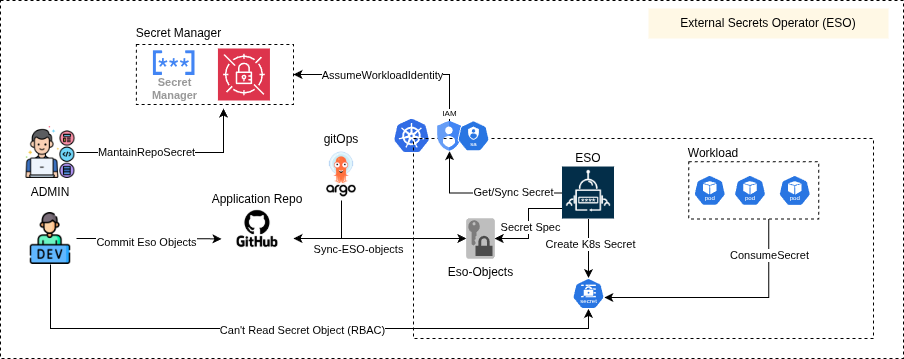
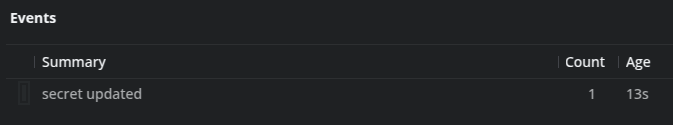

## External Secrets Operator (ESO)

- [Documentação](https://external-secrets.io)



**ESO é um CRD que te permite gerenciar seus secrets no kubernetes apartir de um cofre de senhas como: Hashicorp Vault, AWS Secret Manager, GCP SecretManager entre outros. Com isso você resolve 2 problemas críticos: Os secrets não ficam armazenados localmente na máquina do admin, e os secrets não ficam versionados no repositório Git (oque por si só é impensável).**

### Nesse projeto utilizei o ESO com o GCP Secret Manager:

### Workload Identity

- Para acesso ao secretManager usei uma ServiceAccount(SA) do GCP IAM associada a uma ServiceAccount dentro do Kubernetes
- Para isso é necessário ter a função de WorkloadIdentity ativa no seu GKE, usar esse formato permite que seus pods interajam com recursos da cloud usando contas de serviço do IAM, evitando que o recurso precise ser exposto.
- Para que a SA do ESO pudesse acessar o Secret Manager atribui as roles abaixo:
- Role IAM: roles/secretmanager.secretAccessor

- Esse projeto está deployado via terraform, você pode ver mais detalhes no módulo de gke no arquivo da nodepool: [Repositório Terraform](https://github.com/Adenilson365/devopslabs01-iac)

### Eso

- O ESO em sí foi mais simples de configurar, a documentação é bem escrita e com muito exemplos oque facilita muito a implementação. Se você já tiver uma base boa de: Secrets, Configmaps, Namespaces, ServiceAccount e da estrutura de Yaml e Json, fica muito simples.

- Para essa integração funcionar é necessário ter em mente os seguintes componentes:
- ServiceAccount(k8s) - vai dar a permissão para o ESO ler os secrets no cofre.
- ClusterSecretStore - Vai fazer a configuração base para o ExternalSecrets ler o secrets.
- SecretStore - É o mesmo que ClusterStore, porém restrito ao namespace

```YAML
apiVersion: external-secrets.io/v1
kind: ClusterSecretStore
metadata:
  name: api-secret-store
spec:
  provider:
    gcpsm:
      projectID: "<CodigoProjetoGCP>"
      auth:
        workloadIdentity:
          clusterLocation: "<RegiãoDoCluster>"
          clusterName: "<NomeCluster>"
          serviceAccountRef:
            name: <NomeDaServiceAccount>
            namespace: <namespaceDaServiceAccount>

```

- ExternalSecrets: É o item que vai ler de fato seu SecretManager e criar o Secret no cluster

```YAML
apiVersion: external-secrets.io/v1
kind: ExternalSecret
metadata:
  name: db-secret-ext
  namespace: api
spec:
  refreshInterval: 12h
  secretStoreRef:
    kind: ClusterSecretStore
    name: api-secret-store
  target:
    name: <NomeDoSeuSecretNoKubernetes>
    creationPolicy: Owner

  dataFrom:
    - extract:
        key: <NomeDoSeuSecretNoSecretManager>
```

- Yaml e JSON
- Para armazenar secrets multi-valor armazenei como json no secretManager, e cada campo no json se torna um campo no data do seu secret, já em base64:

```JSON
{
    "campo1" : "valor1",
    "campo2" : "valor2"
}
```

```YAML
data:
  campo1: dmFsb3Ix
  campo2: dmFsb3Iy

```

- Também é possível extrair os valores usando template e filtros navegando na hierarquia JSON (como no jq) para extrair valores específicos.

### RBAC (Role-Based Access Control)

- Com o RBAC, é possível restringir operações sensíveis como leitura ou modificação (patch) de secrets por usuários ou serviços dentro do cluster.
  Essa camada de controle aumenta significativamente a segurança, evitando vazamentos acidentais ou alterações indevidas nos segredos da aplicação — mesmo por parte de quem tem acesso ao cluster.

# Sync da Secret

- Ao fazer o patch da secret o ESO vai voltar pro valor armazenado na secretManager

  
